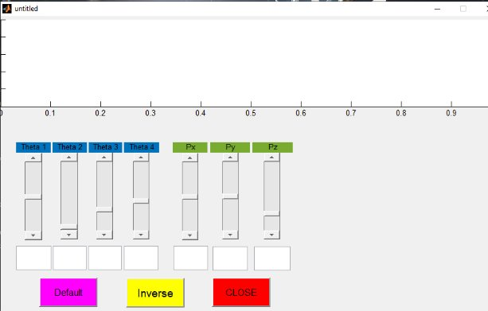

**CÁNH TAY ROBOT  4 BẬC TỰ DO**

1. **Chi tiết cánh tay robot:**

**1.1. Đế robot:**

**1.2.link1:**

**1.3.link2:**

**1.4.link3:**

**1.5.link4:**

1. **Cánh tay robot:**

![ref1]

1. **GIAO DIỆN NGƯỜI DÙNG**
   

**

**TÍNH TOÁN ĐỘNG HỌC CHO CÁNH TAY ROBOT**

1. **ĐỘNG HỌC THUẬN.**

***Tính toán động học thuận.***

- ![ref2]Đặt trục tọa độ cho cánh tay robot:

- **Bảng thông số Denavit – Hartenberg:** 

  Ma trận chuyển đổi tổng quát giữa link I và i+1

  `                  `cosθ        -sinθ\*cosα                  sinθ       cosα\*cosθsinθ\*sinαa\*cosθ  -cosθ\*sinαa\*sinθ0               sinα0                0cosα     d0     1

  BẢNG D-H

||`              `a|α|`            `d|θ|
| - | - | - | - | - |
|1|`            `L1|`           `-90|`        `d1|\*θ1|
|2|`            `L2|`            `0|`        `0 |\*θ2|
|3|`            `L3|`            `0|`        `0|\*θ3|
|4|`            `L4|`            `0|`        `0|\*θ4|
|L1 = 50mm|
| :-: |
|L2 = 90mm|
|L3 = 108mm|
|L4 = 62.5mm|
|d1 = 145mm|

- a là khoảng cách giữa 2 trục z, alpha là góc giữa 2 trục z, d là khoảng cách giữa 2 trục, theta là góc giữa 2 trục x.
- hình vẽ minh họa của cánh tay robot:

  

- Các ma trận chuyển đổi tính toán trên Matlab.

T1=[cosd(t1)    0    -sind(t1)  50\*cosd(t1)  ;sind(t1)  0   cosd(t1)    50\*sind(t1)     ; 0 -1 0 145   ; 0 0 0 1];

T2=[cosd(t2) -sind(t2)  0      90\*cosd(t2)    ; sind(t2) cosd(t2)  0    90\*sind(t2)     ; 0  0 1 0     ; 0 0 0 1];

T3=[cosd(t3) -sind(t3)  0     108\*cosd(t3)   ; sind(t3) cosd(t3)  0      108\*sind(t3)    ; 0  0 1 0     ; 0 0 0 1];

T4=[cosd(t4) -sind(t4)  0    62.5\*cosd(t4)  ; sind(t4) cosd(t4)  0     62.5\*sind(t4)   ; 0  0 1 0     ; 0 0 0 1];

T=T1\*T2\*T3\*T4;

r11r12r21r22r13pxr23pyr31r3200r33pz01

- Tìm Px bằng lệnh 	px= simplify(T(1,4));

py= simplify(T(2,4));

pz= simplify(T(3,4));

suy ra:

px = (cos(t1)\*(125\*cos(t2 + t3 + t4) + 216\*cos(t2 + t3) + 180\*cos(t2) + 100))/2

py = (sin(t1)\*(125\*cos(t2 + t3 + t4) + 216\*cos(t2 + t3) + 180\*cos(t2) + 100))/2

pz= 145 - 108\*sin(t2 + t3) - 90\*sin(t2) - (125\*sin(t2 + t3 + t4))/2T=T1\*T2\*T3\*T4;

1. **ĐỘNG HỌC NGHỊCH.**

` `***Tính toán động học nghịch bằng phương pháp đại số.***

**Ta có:**

T\*T1-1=T1-1\*( T1\*T2\*T3\*T4)

\*\*\*\*\*n1\*n2\*\*00\*n301   =   \*\*\*\*\*m1\*m2\*\*00\*m301

m1 =(125\*cos(t2 + t3 + t4))/2 + 108\*cos(t2 + t3) + 90\*cos(t2)

m2=(125\*sin(t2 + t3 + t4))/2 + 108\*sin(t2 + t3) + 90\*sin(t2)

m3=0

n1 =px\*cos(t1) + py\*sin(t1) - 50

n2 =145 – pz

n3 =py\*cos(t1) - px\*sin(t1)

- **Tính các góc theta:**

Ta có:

` `m3=n3

- py\*cos(t1) - px\*sin(t1)=0
- sin(t1)cos(t1)=pypx
- **T1=atan2(py,px)**

Ta có:

px\*cos(t1) + py\*sin(t1) - 50=(125\*cos(t2 + t3 + t4))/2 + 108\*cos(t2 + t3) + 90\*cos(t2)

145 – pz =(125\*sin(t2 + t3 + t4))/2 + 108\*sin(t2 + t3) + 90\*sin(t2)

- px\*cos(t1) + py\*sin(t1)-50-(125\*cos(t2 + t3 + t4))/2=108\*cos(t2 + t3) + 90\*cos(t2)
- 145 – pz -(125\*sin(t2 + t3 + t4))/2 = 108\*sin(t2 + t3) + 90\*sin(t2)

  Đặt 

  Nx= px\*cos(t1) + py\*sin(t1) – 50  –  62.5\*cos(t2 + t3 + t4)

  Ny=145 – pz  – 62.5\*sin(t2 + t3 + t4)

- Nx =108\*cos(t2 + t3) + 90\*cos(t2)
- Ny  = 108\*sin(t2 + t3) + 90\*sin(t2)
- Nx2+Ny2=1082+902+2\*108\*90\*cos⁡(t3) 
- cost3=Nx2+Ny2-1082-9022\*108\*90
- Sin(t3)=1-cost32
- **t3=atan2(sin(t3),cos(t3))**

Nx =108\*cos(t2 + t3) + 90\*cos(t2)

Ny  = 108\*sin(t2 + t3) + 90\*sin(t2)

- Nx=cos(t2)\*(108cos(t3)+90)-108sin(t2)sin(t3)
- Ny=sin(t2)\*(108cos(t3)+90)+108cos(t2)sin(t3)

Ta có L3=108, L2=90

[ref1]: Aspose.Words.64370153-3c84-4379-923f-d3ac0d6f90a9.006.png
[ref2]: Aspose.Words.64370153-3c84-4379-923f-d3ac0d6f90a9.008.png
